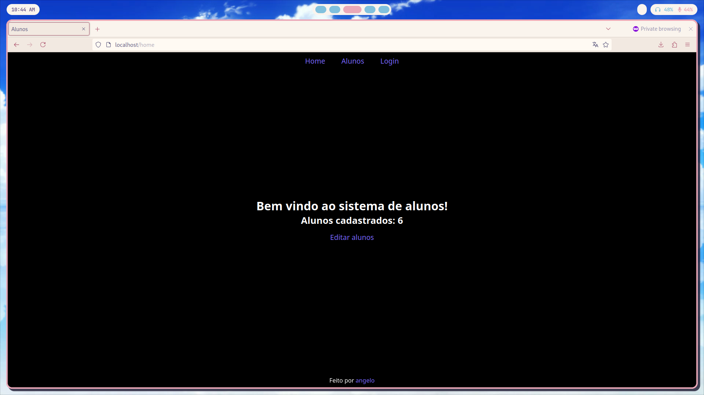

# Student Manager
Student Manager é uma aplicação web desenvolvida para gerenciar alunos e suas notas. Usando Go (Golang) para o backend e SQLite para o banco de dados, a aplicação permite autenticação de usuários e visualização de informações dos alunos.

## **Funcionalidades:**
- **Login de Usuário:** Usuários podem se autenticar usando seu nome de usuário e senha.
- **Gerenciamento de Sessões:** Geração e validação de tokens de sessão para manter os usuários logados.
- **Interface do Usuário:** Um design simples com cabeçalho e rodapé fixos.

## **Tecnologias Utilizadas:**
- **Backend:** Go (Golang) para lógica do servidor e manipulação do banco de dados.
- **Frontend:** Templates HTML, CSS e JavaScript para a interface do usuário.
- **Banco de Dados:** SQLite para armazenar dados de usuários e sessões.

## **Estrutura do Projeto:**

- **`cmd/`**: Contém os pontos de entrada principais da aplicação, inclui o diretório `alunos` com o arquivo `main.go` que inicializa o servidor e chama o roteamento de routes.go.

- **`db/`**: Este diretório é destinado a arquivos relacionados ao banco de dados, incluindo o arquivo do banco de dados SQLite (`database.db`) que armazena dados de usuários e sessões, além do esquema SQL.

- **`internal/`**: Contém pacotes internos usados dentro do projeto. Estes pacotes incluem lógica central e serviços, como autenticação de usuários e gerenciamento de sessões.

  - **`handlers/`**: Gerencia as requisições HTTP e define as ações a serem tomadas para cada rota. É responsável por processar e responder os requests dos usuários.

  - **`models/`**: Define as estruturas de dados e os modelos usados na aplicação, representando as entidades do sistema como alunos e informações de login.

  - **`routes/`**: Configura e define as rotas da aplicação, mapeando Métodos e URLs para funções específicas nos handlers.

  - **`services/`**: Implementa a lógica de negócio e serviços auxiliares, como autenticação e gerenciamento de sessões.

- **`Makefile`**: Fornece um conjunto de targets para automatizar tarefas. Por exemplo, inclui alvos para executar a aplicação e definir variáveis de ambiente.

- **`web/`**: Contém os assets do frontend, incluindo templates HTML, estilos CSS e arquivos JavaScript usados para construir a interface do usuário.

## Uso de Cookies e Hashing de Senhas

### Uso de Cookies

- **Cookie de Sessão:** Quando um usuário faz login com sucesso, um cookie de sessão é criado e enviado para o cliente. Este cookie contém um token de sessão que identifica a sessão do usuário. O cookie é marcado como `HttpOnly` para impedir o acesso via JavaScript, melhorando a segurança.

  **Como Funciona:**
  1. **Requisição de Login:** Quando um usuário faz login, o servidor gera um token de sessão único.
  2. **Criação do Cookie:** O token é salvo em um cookie com o nome `session_token`.
  3. **Armazenamento do Cookie:** O cookie é enviado para o navegador do usuário e é incluído nas requisições subsequentes para autenticar o usuário.
  4. **Validação da Sessão:** O servidor verifica o token no cookie em relação aos tokens armazenados para validar a sessão.

  **`HttpOnly`:** Garante que o cookie não possa ser acessado por scripts do lado do cliente, reduzindo o risco de ataques de cross-site scripting (XSS).

### Hashing de Senhas

A aplicação armazena versões hash das senhas usando o pacote `x/crypto/bcrypt` do Go.

- **Processo de Hashing:**
  1. **Hashing de Senha:** Quando um usuário cria ou atualiza sua senha, ela é hashada usando o algoritmo bcrypt.
  2. **Armazenamento:** A senha hashada é armazenada no banco de dados em vez da senha em texto puro.
  3. **Verificação:** Durante o login, a senha inserida é hashada e comparada com o hash armazenado para verificar as credenciais do usuário.

- **Algoritmo bcrypt:**
  - **Salting:** O bcrypt adiciona automaticamente um salt às senhas antes do hashing. Um salt é um valor aleatório adicionado à senha antes do hashing para garantir que a mesma senha tenha um hash único cada vez.
  - **Key Stretching:** O bcrypt aplica várias iterações de hashing para aumentar o custo computacional para atacantes, tornando ataques de força bruta mais difíceis.

**Benefícios de Segurança:**
- **Proteção Contra Exposição em Texto Puro:** Mesmo que o banco de dados seja comprometido, os hashes armazenados não são facilmente reversíveis para revelar senhas em texto puro.
- **Resiliência a Rainbow Tables:** O salting garante que até mesmo senhas idênticas terão hashes diferentes, prevenindo o uso de Rainbow Tables para decifrar senhas.
